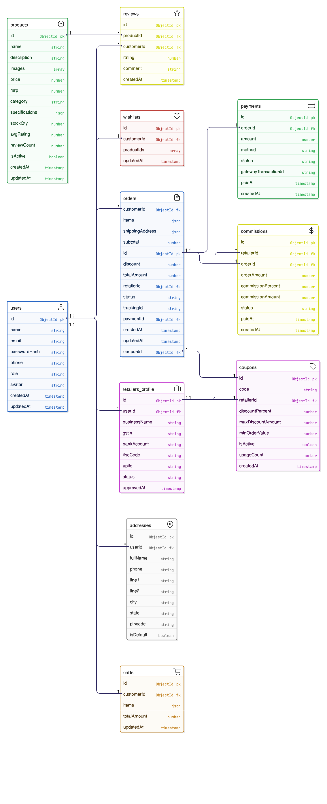
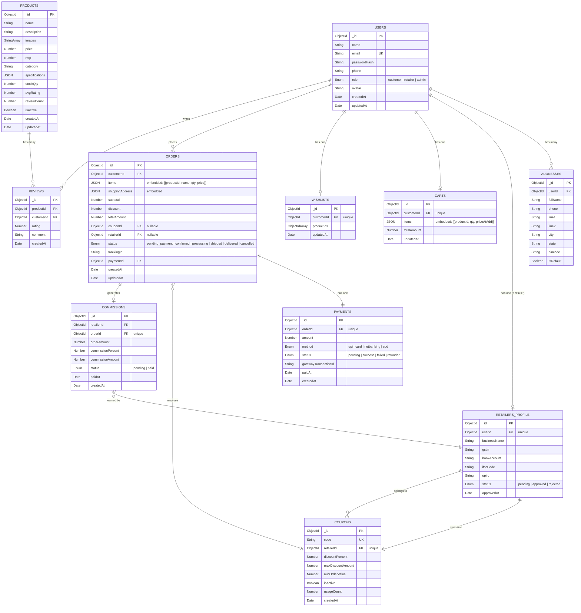

# ER Diagram — Siddham Coolers E-Commerce Platform

### 📊 Rendered Diagram

---

## Overview

The database is designed for **MongoDB** (document-oriented), but the ER diagram below models the entities and relationships in a relational style for clarity. Each "table" maps to a MongoDB **collection**, and embedded sub-documents are noted where applicable.

---

## Entity-Relationship Diagram

---

## Collection Details

### `users`

| Field | Type | Constraints | Description |
|---|---|---|---|
| `_id` | ObjectId | PK | Auto-generated |
| `name` | String | Required | Full name |
| `email` | String | Required, Unique | Login email |
| `passwordHash` | String | Required | bcrypt-hashed password |
| `phone` | String | Required | Contact number |
| `role` | Enum | Required | `customer` \| `retailer` \| `admin` |
| `avatar` | String | Optional | Profile image URL |
| `createdAt` | Date | Auto | Account creation timestamp |
| `updatedAt` | Date | Auto | Last update timestamp |

---

### `addresses`

| Field | Type | Constraints | Description |
|---|---|---|---|
| `_id` | ObjectId | PK | Auto-generated |
| `userId` | ObjectId | FK → users | Owner |
| `fullName` | String | Required | Recipient name |
| `phone` | String | Required | Recipient phone |
| `line1` | String | Required | Street address |
| `line2` | String | Optional | Landmark / area |
| `city` | String | Required | City |
| `state` | String | Required | State |
| `pincode` | String | Required | PIN code |
| `isDefault` | Boolean | Default: false | Default shipping address |

---

### `products`

| Field | Type | Constraints | Description |
|---|---|---|---|
| `_id` | ObjectId | PK | Auto-generated |
| `name` | String | Required | Product name |
| `description` | String | Required | Detailed description |
| `images` | String[] | Min: 1 | Product image URLs |
| `price` | Number | Required | Selling price (₹) |
| `mrp` | Number | Required | Maximum retail price (₹) |
| `category` | String | Required | e.g., "Desert", "Tower", "Personal" |
| `specifications` | Object | Optional | Key-value pairs (capacity, power, etc.) |
| `stockQty` | Number | Required, ≥ 0 | Available stock |
| `avgRating` | Number | Default: 0 | Computed average rating |
| `reviewCount` | Number | Default: 0 | Total reviews |
| `isActive` | Boolean | Default: true | Soft delete / visibility toggle |
| `createdAt` | Date | Auto | — |
| `updatedAt` | Date | Auto | — |

---

### `reviews`

| Field | Type | Constraints | Description |
|---|---|---|---|
| `_id` | ObjectId | PK | Auto-generated |
| `productId` | ObjectId | FK → products | Reviewed product |
| `customerId` | ObjectId | FK → users | Reviewer |
| `rating` | Number | 1–5 | Star rating |
| `comment` | String | Optional | Review text |
| `createdAt` | Date | Auto | — |

**Index:** Compound unique index on `(productId, customerId)` — one review per customer per product.

---

### `carts`

| Field | Type | Constraints | Description |
|---|---|---|---|
| `_id` | ObjectId | PK | Auto-generated |
| `customerId` | ObjectId | FK → users, Unique | Cart owner |
| `items` | Array | Embedded | `[{productId, quantity, priceAtAdd}]` |
| `totalAmount` | Number | Computed | Sum of item prices × quantities |
| `updatedAt` | Date | Auto | — |

---

### `coupons`

| Field | Type | Constraints | Description |
|---|---|---|---|
| `_id` | ObjectId | PK | Auto-generated |
| `code` | String | Required, Unique | e.g., `RETAIL-AMIT-10` |
| `retailerId` | ObjectId | FK → retailers_profile, Unique | Owning retailer |
| `discountPercent` | Number | Required, 1–100 | Discount percentage |
| `maxDiscountAmount` | Number | Required | Cap on discount (₹) |
| `minOrderValue` | Number | Default: 0 | Minimum order to avail |
| `isActive` | Boolean | Default: true | Can be deactivated by admin |
| `usageCount` | Number | Default: 0 | Times used |
| `createdAt` | Date | Auto | — |

---

### `orders`

| Field | Type | Constraints | Description |
|---|---|---|---|
| `_id` | ObjectId | PK | Auto-generated |
| `customerId` | ObjectId | FK → users | Buyer |
| `items` | Array | Embedded | `[{productId, productName, quantity, priceAtPurchase}]` |
| `shippingAddress` | Object | Embedded | Snapshot of address at order time |
| `subtotal` | Number | Required | Pre-discount total |
| `discount` | Number | Default: 0 | Coupon discount amount |
| `totalAmount` | Number | Required | Final payable amount |
| `couponId` | ObjectId | FK → coupons, Nullable | Applied coupon |
| `retailerId` | ObjectId | FK → retailers_profile, Nullable | Referring retailer |
| `status` | Enum | Required | `pending_payment` → `confirmed` → `processing` → `shipped` → `delivered` |
| `trackingId` | String | Nullable | Shipping tracking ID |
| `paymentId` | ObjectId | FK → payments | Linked payment |
| `createdAt` | Date | Auto | — |
| `updatedAt` | Date | Auto | — |

**Indexes:** `customerId`, `retailerId`, `status`, `createdAt`.

---

### `payments`

| Field | Type | Constraints | Description |
|---|---|---|---|
| `_id` | ObjectId | PK | Auto-generated |
| `orderId` | ObjectId | FK → orders, Unique | Linked order |
| `amount` | Number | Required | Amount charged |
| `method` | Enum | Required | `upi` \| `card` \| `netbanking` \| `cod` |
| `status` | Enum | Required | `pending` \| `success` \| `failed` \| `refunded` |
| `gatewayTransactionId` | String | Nullable | ID from Razorpay / Stripe |
| `paidAt` | Date | Nullable | Payment completion time |
| `createdAt` | Date | Auto | — |

---

### `commissions`

| Field | Type | Constraints | Description |
|---|---|---|---|
| `_id` | ObjectId | PK | Auto-generated |
| `retailerId` | ObjectId | FK → retailers_profile | Earning retailer |
| `orderId` | ObjectId | FK → orders, Unique | Source order |
| `orderAmount` | Number | Required | Order total |
| `commissionPercent` | Number | Required | % of order amount |
| `commissionAmount` | Number | Required | Actual ₹ earned |
| `status` | Enum | Required | `pending` \| `paid` |
| `paidAt` | Date | Nullable | Payout date |
| `createdAt` | Date | Auto | — |

**Index:** `retailerId`, `status`.

---

### `retailers_profile`

| Field | Type | Constraints | Description |
|---|---|---|---|
| `_id` | ObjectId | PK | Auto-generated |
| `userId` | ObjectId | FK → users, Unique | Linked user account |
| `businessName` | String | Required | Retailer's shop name |
| `gstin` | String | Optional | GST identification number |
| `bankAccount` | String | Optional | For commission payouts |
| `ifscCode` | String | Optional | Bank IFSC |
| `upiId` | String | Optional | UPI ID for payouts |
| `status` | Enum | Required | `pending` \| `approved` \| `rejected` |
| `approvedAt` | Date | Nullable | Approval timestamp |

---

### `wishlists`

| Field | Type | Constraints | Description |
|---|---|---|---|
| `_id` | ObjectId | PK | Auto-generated |
| `customerId` | ObjectId | FK → users, Unique | Owner |
| `productIds` | ObjectId[] | FK → products | Wishlisted products |
| `updatedAt` | Date | Auto | — |

---

## Relationship Summary

| From | To | Cardinality | Description |
|---|---|---|---|
| users | addresses | 1 : N | A user has many addresses |
| users | retailers_profile | 1 : 0..1 | A retailer user has one profile |
| users | carts | 1 : 1 | One cart per customer |
| users | wishlists | 1 : 1 | One wishlist per customer |
| users | orders | 1 : N | Customer places many orders |
| users | reviews | 1 : N | Customer writes many reviews |
| retailers_profile | coupons | 1 : 1 | Each retailer has one coupon |
| products | reviews | 1 : N | Product has many reviews |
| orders | payments | 1 : 1 | Each order has one payment |
| orders | coupons | N : 0..1 | Many orders can use a coupon (optional) |
| orders | commissions | 1 : 0..1 | Coupon-linked order generates commission |
| commissions | retailers_profile | N : 1 | Many commissions earned by one retailer |
