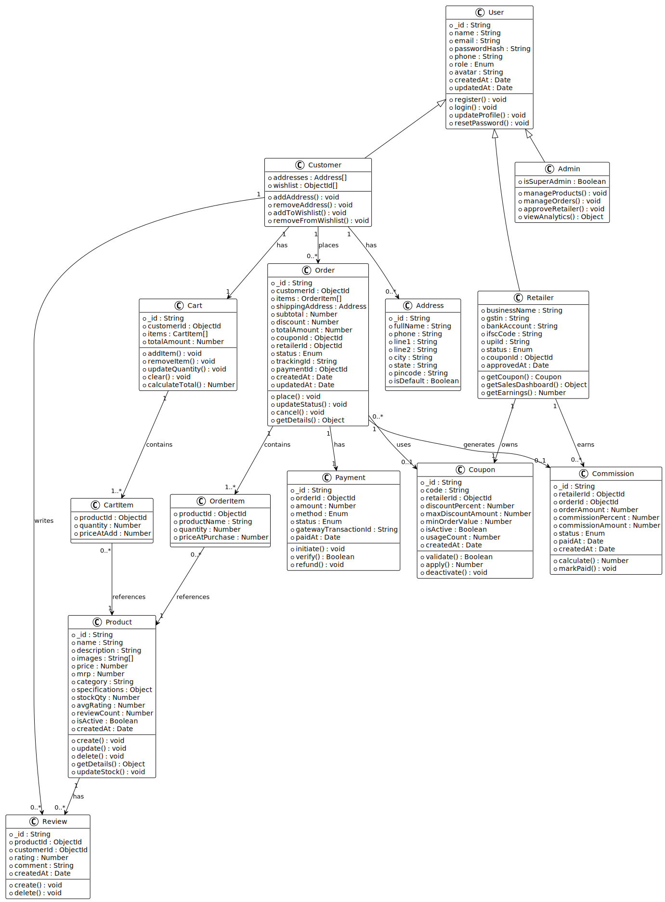
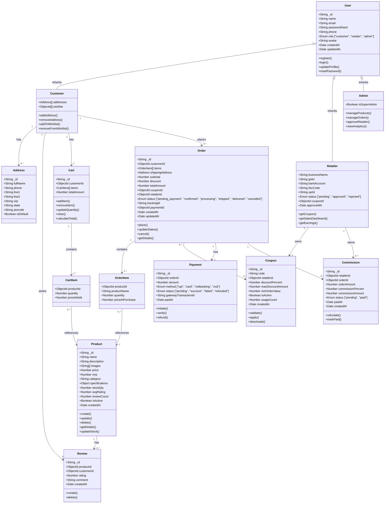

# Class Diagram — Siddham Coolers E-Commerce Platform

### 📊 Rendered Diagram

---

## Overview

The system follows a layered architecture: **Controller → Service → Repository (Model)**. The class diagram below captures the **domain model** — the core entities and their relationships.

---

## Class Diagram

---

## Class Descriptions

### Core Entities

| Class | Responsibility |
|---|---|
| **User** | Base class for all users; stores common auth & profile data |
| **Customer** | Extends User; manages addresses, wishlist, and places orders |
| **Retailer** | Extends User; owns a coupon, tracks sales & commissions |
| **Admin** | Extends User; manages the entire platform |

### Product Domain

| Class | Responsibility |
|---|---|
| **Product** | Represents an air cooler in the catalogue |
| **Review** | Customer review & rating for a product |

### Order Domain

| Class | Responsibility |
|---|---|
| **Cart** | Temporary collection of items before checkout |
| **CartItem** | Individual item within a cart |
| **Order** | Confirmed purchase with delivery status tracking |
| **OrderItem** | Snapshot of product at time of purchase |
| **Payment** | Payment transaction linked to an order |

### Affiliate Domain

| Class | Responsibility |
|---|---|
| **Coupon** | Discount code owned by a retailer |
| **Commission** | Retailer's earnings record for a coupon-linked order |
| **Address** | Reusable shipping / billing address for a customer |

---

## Key Relationships Summary

| Relationship | Type | Description |
|---|---|---|
| User → Customer / Retailer / Admin | Inheritance | Role-specific specialisation |
| Customer → Cart | 1 : 1 | Each customer has one active cart |
| Customer → Order | 1 : Many | Customer can place many orders |
| Order → OrderItem | 1 : Many | Order contains multiple items |
| Order → Coupon | Many : 0..1 | Order may use one coupon |
| Order → Payment | 1 : 1 | Each order has exactly one payment |
| Retailer → Coupon | 1 : 1 | Each retailer has one unique coupon |
| Retailer → Commission | 1 : Many | Retailer earns commission on each coupon-linked order |
| Product → Review | 1 : Many | Product can have many reviews |
