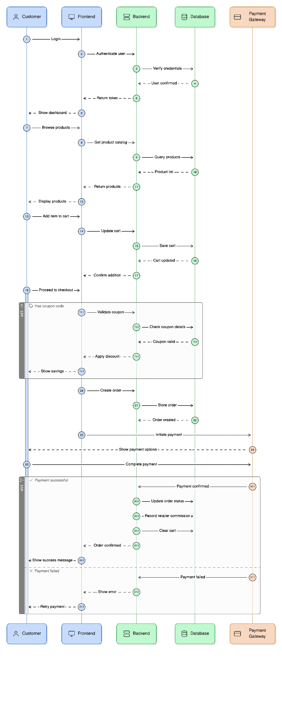
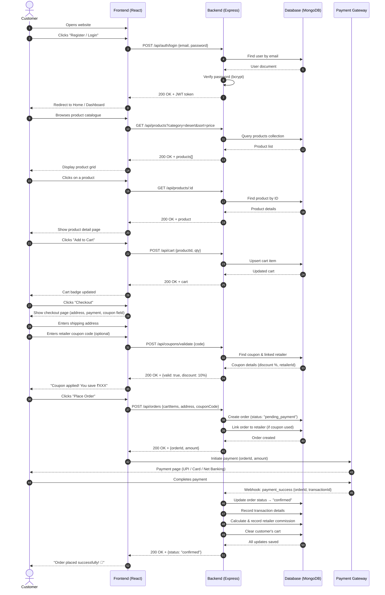
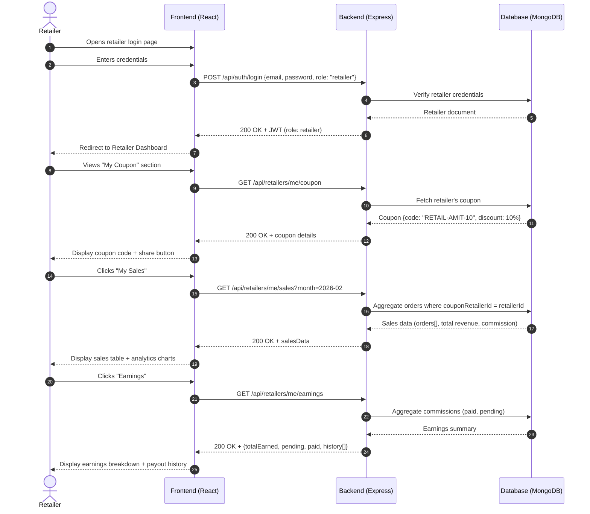
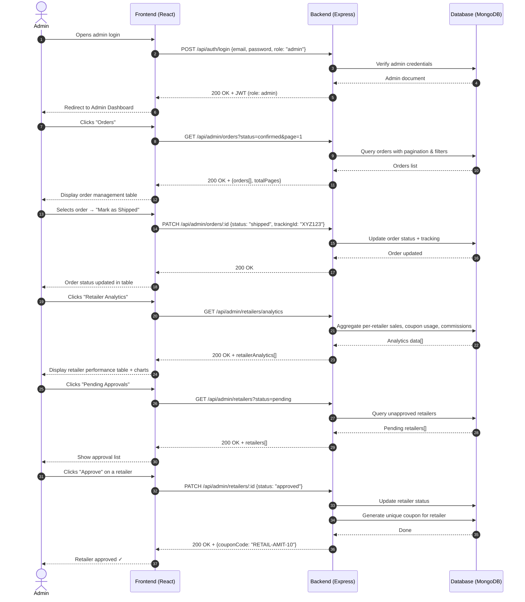
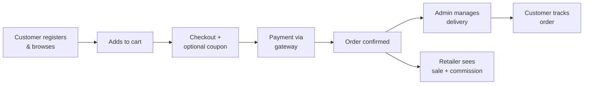

# Sequence Diagrams — Siddham Coolers E-Commerce Platform

### 📊 Rendered Diagram

---

## 1. Main Flow: Customer Browses, Applies Coupon & Places Order

This is the **primary end-to-end flow** of the application.

---

## 2. Retailer Flow: View Sales & Earnings

---

## 3. Admin Flow: Manage Orders & View Retailer Analytics

---

## 4. Flow Summary

