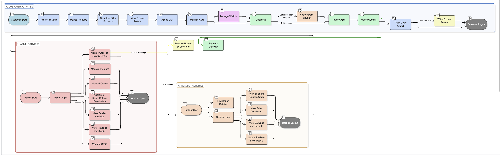
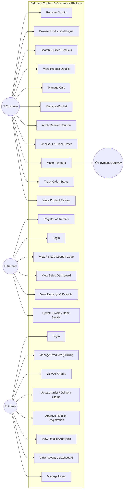
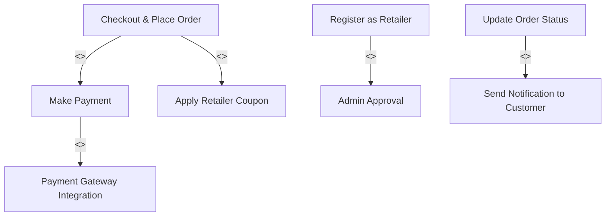

# Use Case Diagram — Siddham Coolers E-Commerce Platform

### 📊 Rendered Diagram

---

## Actors

| Actor | Description |
|---|---|
| **Customer** | End user who browses, orders products, and optionally applies a retailer coupon |
| **Retailer** | Distribution partner who shares coupon codes and earns commission |
| **Admin** | Business administrator who manages orders, products, and retailer analytics |
| **Payment Gateway** | External system (Razorpay / Stripe) that processes payments |

---

## Use Case Diagram

---

## Use Case Descriptions

### Customer Use Cases

| # | Use Case | Description | Pre-condition | Post-condition |
|---|---|---|---|---|
| UC1 | Register / Login | Customer creates an account or logs in | None | Customer is authenticated |
| UC2 | Browse Product Catalogue | View all available air coolers | None | Product list displayed |
| UC3 | Search & Filter Products | Search by name; filter by type, price, rating | None | Filtered results shown |
| UC4 | View Product Details | See images, specs, price, reviews for a product | None | Product detail page rendered |
| UC5 | Manage Cart | Add, update quantity, or remove items from cart | Logged in | Cart updated |
| UC6 | Manage Wishlist | Save products for later | Logged in | Wishlist updated |
| UC7 | Apply Retailer Coupon | Enter a retailer's coupon code at checkout for a discount | Cart has items | Discount applied; coupon linked to retailer |
| UC8 | Checkout & Place Order | Provide address, review order, confirm purchase | Cart has items; logged in | Order created |
| UC9 | Make Payment | Pay via UPI / card / net banking through payment gateway | Order placed | Payment confirmed |
| UC10 | Track Order Status | View current status of placed orders | Order exists | Status displayed |
| UC11 | Write Product Review | Rate and review a purchased product | Order delivered | Review saved |

### Retailer Use Cases

| # | Use Case | Description | Pre-condition | Post-condition |
|---|---|---|---|---|
| UC12 | Register as Retailer | Submit registration request with business details | None | Request sent to admin |
| UC13 | Login | Authenticate into retailer dashboard | Approved by admin | Dashboard accessible |
| UC14 | View / Share Coupon Code | Access unique coupon code and share with customers | Logged in | Coupon displayed |
| UC15 | View Sales Dashboard | See all orders placed using retailer's coupon | Logged in | Sales data displayed |
| UC16 | View Earnings & Payouts | Track commission earned and payout history | Logged in | Earnings data displayed |
| UC17 | Update Profile / Bank Details | Modify contact info and payout details | Logged in | Profile updated |

### Admin Use Cases

| # | Use Case | Description | Pre-condition | Post-condition |
|---|---|---|---|---|
| UC18 | Login | Authenticate into admin panel | Has admin credentials | Admin panel accessible |
| UC19 | Manage Products (CRUD) | Create, read, update, delete products in catalogue | Logged in | Catalogue updated |
| UC20 | View All Orders | See complete order list with filters | Logged in | Order list displayed |
| UC21 | Update Order / Delivery Status | Change status to shipped / out-for-delivery / delivered | Order exists | Status updated; customer notified |
| UC22 | Approve Retailer Registration | Review and approve / reject retailer applications | Pending request exists | Retailer account activated or rejected |
| UC23 | View Retailer Analytics | See per-retailer sales count, revenue, and commission | Logged in | Analytics displayed |
| UC24 | View Revenue Dashboard | Overall sales, revenue trends, top products | Logged in | Dashboard rendered |
| UC25 | Manage Users | View / deactivate customer and retailer accounts | Logged in | User list managed |

---

## Include & Extend Relationships

> **`<<include>>`** — The base use case always triggers the included use case.
> **`<<extend>>`** — The extending use case is optional and triggered only under certain conditions (e.g., coupon application is optional at checkout).
